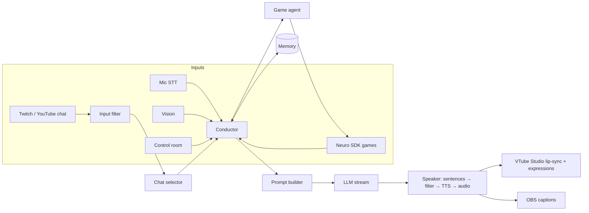

# NeuroClone

An open-source AI VTuber runtime, built by researching how [Neuro-sama](https://www.twitch.tv/vedal987) works and then engineering past her known weak spots. It chats with Twitch/YouTube viewers, talks with you by voice, plays games through the official Neuro SDK protocol, drives a VTube Studio avatar, remembers people across streams, and can fine-tune its own small model from its streams.

It runs on your own PC, **offline and free**: a one-click installer detects your GPU, picks models that fit, downloads them once, and from then on no API keys are needed and no data leaves your machine. See [docs/LOCAL_SETUP.md](docs/LOCAL_SETUP.md).

It ships with two **original** characters: **Nexa**, a self-aware AI streamer with gremlin energy, and her twin **Vexa**, calm, theatrical and politely menacing. Make your own with a YAML card.

> NeuroClone is not affiliated with Neuro-sama or Vedal. It recreates the *architecture*, not the character: don't use it to impersonate them.

## How this was built

1. **Research** ([`docs/RESEARCH.md`](docs/RESEARCH.md)): everything public about how Neuro-sama works (history, LLM, voice, filter, memory, vision, the Neuro SDK game protocol, open-source recreations, community theories), with confidence labels and sources.
2. **Super prompt** ([`docs/SUPER_PROMPT.md`](docs/SUPER_PROMPT.md)): the research distilled into one build brief for an AI coding agent: architecture, the characters, ten "beat Neuro-sama" goals with acceptance tests, and a definition of done.
3. **Execution**: the super prompt was followed to produce this repository. You can reuse it to rebuild or extend the project with any coding agent.

## What you get

- **Runs on your PC, tuned to it**: `neuroclone setup` detects CPU, RAM and GPU (NVIDIA, AMD, Intel, Apple), picks the best local models that fit (Qwen 3.5 / Gemma 4 through Ollama), writes a tuned config and benchmarks it. The GPU goes to the brain; the voice, ears and memory run on the CPU. Live replies always get the GPU first.
- **Streaming brain**: Ollama's native API (context size, thinking off and model residency set per request), any OpenAI-compatible server (LM Studio, llama.cpp, vLLM), Claude, or an offline mock. The first sentence is spoken while the rest is still generating.
- **A character, not a chatbot**: persona cards → a stable, cache-friendly character prompt; emotion tags drive the face and voice; running bits have hourly budgets so they stay funny.
- **Memory across streams**: SQLite + vector recall scored by relevance, recency and importance; viewer profiles; facts viewers share; periodic reflections; an end-of-stream summary and diary.
- **Chat intelligence**: every message gets an inspectable score (mentions, questions, support, newcomers, novelty, fairness, spam), softmax sampling for liveliness, and "vibe" detection when chat converges on one thing.
- **Graceful safety**: input *and* output filtering per sentence, normalisation against leetspeak and spacing tricks, hashed slur lists (no slurs in the repo), injection and PII checks, prompt-leak detection, optional LLM moderation run in parallel with TTS. A blocked sentence becomes an in-character deflection instead of a dead "Filtered."
- **Games**: a server that implements the **official Neuro SDK spec** (actions, forces with priorities, results, `speech_finished`, the voice chat side-channel), so games built for Neuro can connect by setting `NEURO_SDK_WS_URL`. A validating game agent retries bad moves and can never deadlock a forced decision.
- **Voice, ears and face**: offline Kokoro voices in-process (blendable, pitch-shiftable, faster than real time on a CPU), plus Azure / edge-tts / any OpenAI-compatible TTS, with emotional prosody; faster-whisper STT with barge-in and echo guard; VTube Studio lip-sync injected straight from the audio envelope (no virtual cable) plus mood-driven smile and expression hotkeys.
- **Twins**: two characters on one stage with turn-taking and bounded banter.
- **Control room**: a local dashboard (live transcript with latency, chat with filter verdicts, "why this message?", mood, games, memory search, moderator controls) and an OBS caption overlay.
- **Self-improvement loop**: generate persona data with a teacher model, curate your own stream transcripts, LoRA/QLoRA fine-tune a small model, evaluate with a regression gate, export to GGUF. See [`training/README.md`](training/README.md).

## Neuro-sama vs. NeuroClone

| | Neuro-sama (public info, see research) | NeuroClone |
|---|---|---|
| Brain | Small custom fine-tuned local LLM (rumoured ~2B) | Any local/cloud LLM today; the same fine-tune path to put the persona into a small model's weights |
| Memory | Limited/unclear across streams | Episodic + semantic memory, viewer profiles, reflections, stream diary |
| Filter | Blunt "Filtered.", sometimes bypassed | Per-sentence, obfuscation-aware, input+output, in-character deflections, optional LLM moderation |
| Loops | Known to repeat and get stuck | Repetition guard + overused-phrase feedback + bit budgets |
| Chat selection | Not public | Explicit, inspectable scorer with fairness and vibe detection |
| Games | Neuro SDK + per-game AIs | Same protocol (server side) + validating agent with retries |
| Collabs | Turn-taking issues early on | Barge-in, force-priority interrupts, speaker attribution |
| Vision | ~5 s, blocks | Async, never blocks speech |
| Data curation | By hand | Automated judge + rewrite + optional human sign-off |
| Source | Closed | Open, configurable, runs offline |

Neuro-sama also has years of iteration, her own data and a lot of craft behind her. NeuroClone gives you the architecture and tooling; how good *your* character gets depends on the model, the persona card and the data you feed it.

## Quick start

**On your PC (Windows)**: download the repository, double-click **`install.bat`**, then **`start.bat`**. The installer sets up Python packages and [Ollama](https://ollama.com), detects your hardware, downloads the right models once, and benchmarks them. Linux and macOS: `scripts/install.sh`. Full guide, including what gets picked for each GPU size: [docs/LOCAL_SETUP.md](docs/LOCAL_SETUP.md).

```bash
# the same by hand, on any OS
pip install -e '.[local]'
neuroclone setup            # detect, plan, write config/local.yaml, download, benchmark
neuroclone chat             # talk to her (the control room is at http://127.0.0.1:8080)
```

**Try it in 30 seconds** (no GPU, no downloads): an offline mock brain that exercises the whole pipeline.

```bash
git clone https://github.com/NuelNexus/NeuroClone && cd NeuroClone
python -m venv .venv && source .venv/bin/activate      # Python 3.10+
pip install -e .
neuroclone chat --mock
```

Type as a viewer (`alice: hi nexa!`), as yourself by voice (`> did you break the build again?`), or trigger events (`/sub bob 3`, `/raid carol 40`). Open the control room at http://127.0.0.1:8080 while it runs. The mock brain is a tiny offline improv engine for trying the pipeline, not a real model.

You can also pipe a script in (one line per message, same syntax). The character answers everything queued and then exits:

```bash
printf 'alice: hi nexa!\n> say hi to everyone\n/sub bob 3\n' | neuroclone chat --mock
```

## Real setups

**1. Brain.** Pick one:
- Local (recommended): `neuroclone setup` picks and downloads a model for your GPU. By hand: `ollama pull gemma4:12b`, then set `llm.model`.
- LM Studio / llama.cpp / vLLM: see [`config/examples/local-lmstudio-kokoro.yaml`](config/examples/local-lmstudio-kokoro.yaml).
- Claude: `pip install -e '.[anthropic]'`, `export ANTHROPIC_API_KEY=...`, `neuroclone chat -c config/examples/claude.yaml`. Uses `claude-opus-5` at low effort for fast live replies, with server-side refusal fallbacks on (`llm.fallbacks: false` turns them off).

**2. Voice.** Set `tts.provider`:
- `kokoro` (offline, free, in-process; `pip install -e '.[local]'`, files fetched by `neuroclone setup`). Blend voices (`af_bella:0.7+af_sky:0.3`) and shift the pitch (`tts.pitch_semitones: 2`) for a character voice.
- `azure` with `AZURE_SPEECH_KEY`: the same kind of voice Neuro-sama uses (Azure neural TTS + SSML prosody).
- `edge` (`pip install -e '.[edge-tts]'`): free online voices.
- `openai`: any `/audio/speech` server, such as [Kokoro-FastAPI](https://github.com/remsky/Kokoro-FastAPI).
- Test a voice with `neuroclone say "[happy] Hello chat!"`.

**3. Ears.** Set `stt.enabled: true` (or `neuroclone setup --mic`) to talk to her by microphone. Whisper runs on the CPU, and when you start talking she stops and listens.

**4. Face.** In VTube Studio: Settings → Start API (port 8001). Set `avatar.enabled: true` and map emotions to your model's hotkeys (`avatar.hotkeys: {happy: Smile, angry: Angry}`). Click "Allow" in VTube Studio the first time.

**5. Chat.** Set `chat.twitch.channel` (reading is anonymous) and/or `chat.youtube.video_id` + `api_key`, then `neuroclone run`.

**6. Games.** Anything built on the [Neuro SDK](https://github.com/VedalAI/neuro-sdk), such as the official Inscryption, Slay the Spire 2, Buckshot Roulette, Hollow Knight, Cyberpunk and Pokémon Platinum integrations, can connect with `NEURO_SDK_WS_URL=ws://localhost:8000`. To test your own integration without streaming: `neuroclone neuro-api`.

**7. Go live.** Add http://127.0.0.1:8080/overlay as an OBS browser source for captions, and keep the control room open to pause, skip, steer or block things instantly.

Run `neuroclone doctor` any time to check models, voices, devices and ports.

### Hardware tiers (all local and free)

| GPU | Brain (balanced) | Voice, ears, memory | Notes |
|---|---|---|---|
| none | Qwen 3.5 2B on the CPU | Kokoro, Whisper, embeddings on the CPU | Works; replies take a second or two |
| 6 GB | Qwen 3.5 4B | on the CPU | Fast and fun |
| 8 GB | Gemma 4 E4B (quality: Qwen 3.5 9B) | on the CPU | A typical streaming PC |
| 12–16 GB | Gemma 4 12B (quality on 16 GB: Gemma 4 26B MoE) | on the CPU | The sweet spot |
| 24 GB+ | Gemma 4 31B | on the CPU | Best wit and game decisions |

`neuroclone setup` makes this choice for you and reserves VRAM for OBS and VTube Studio while streaming. Latency is measured on every turn (time to first token and to first audio) and shown in the control room; `neuroclone bench` measures it on demand.

## Make your own character

Copy [`neuroclone/data/personas/nexa.yaml`](neuroclone/data/personas/nexa.yaml) to `config/personas/mychar.yaml`, edit it, and set `persona: mychar`. Set `creator: YourName` so the character knows who made them. `neuroclone persona show mychar` prints the exact prompt the model will see.

## Train your own model

The persona prompt works on day one with any decent model. To get Neuro-style speed from a small model, put the personality into its weights. [`training/README.md`](training/README.md) covers synthetic data from a teacher, transcript curation, LoRA/QLoRA, the eval gate, and GGUF export.

## Architecture



Details are in [`docs/ARCHITECTURE.md`](docs/ARCHITECTURE.md).

## Safety and ethics

- Keep a human moderator with the control room open. **Skip** and **Pause** stop speech instantly.
- The built-in lists target severe harms. For a family-friendly stream add a broader list: `neuroclone blocklist fetch`, then `safety.blocklists: [data/blocklist_community.txt]`. Consider `safety.llm_moderation: true`.
- Tell viewers they're talking to an AI, follow your platform's rules, and only train on conversations you have the right to use.
- Don't clone real people's voices or characters without permission.

## Commands

| Command | What it does |
|---|---|
| `neuroclone setup [--prefer speed\|balanced\|quality] [--mic]` | Detect this PC, pick models, write `config/local.yaml`, download, benchmark |
| `neuroclone bench` | Time to first word, tokens/s, GPU share and voice speed on this PC |
| `neuroclone chat [--mock]` | Talk to the character in your terminal (control room included) |
| `neuroclone run [--console]` | Go live: chat sources, voice, avatar, games, dashboard |
| `neuroclone neuro-api` | Neuro SDK game server only, for testing integrations |
| `neuroclone say "text"` | Speak one line with the configured voice |
| `neuroclone doctor` | Check config, model, voice, devices and ports |
| `neuroclone persona list \| show [id]` | Personas and the rendered character prompt |
| `neuroclone memory stats \| search Q \| forget USER` | Inspect or edit long-term memory |
| `neuroclone blocklist fetch` | Download a community word list |

Add `-c config.yaml` and `--set section.key=value` to any of them. Without `-c`, `config/local.yaml` (written by setup) is used if it exists, else `config/default.yaml`.

## Development

```bash
pip install -e '.[dev]'
pytest                      # ~160 tests, fully offline: no network, GPU or audio device needed
```

```
neuroclone/        runtime package (conductor, speaker, llm/, memory/, safety/, speech/, games/, chat/, avatar/, overlay/)
training/          data generation, curation, LoRA fine-tuning, evaluation
config/            default config and examples
docs/              research notes, the super prompt, architecture
tests/             pytest suite
```

## Status

Tested thoroughly offline: unit tests, a real websocket Neuro API session, the voice side-channel, VTube Studio against a fake server, the Ollama backend and the whole runtime against a fake Ollama server, the live-priority scheduler, the hardware planner, and full runtime runs with the mock brain. The real Kokoro voice was run on a CPU (full precision is faster than real time; the int8 model was about 6x slower, so setup avoids it) and the pitch shift was measured. The fine-tuning script was smoke-tested end to end on CPU with a tiny model against current TRL/transformers/PEFT.

Not yet exercised in this repo: a real Ollama server on a GPU (the sandbox had none), live Twitch/YouTube streams, real VTube Studio, real game mods, the Windows installer on a real Windows PC, and GPU fine-tuning runs. Those follow their public APIs and documented behavior, and issues and PRs are welcome.
