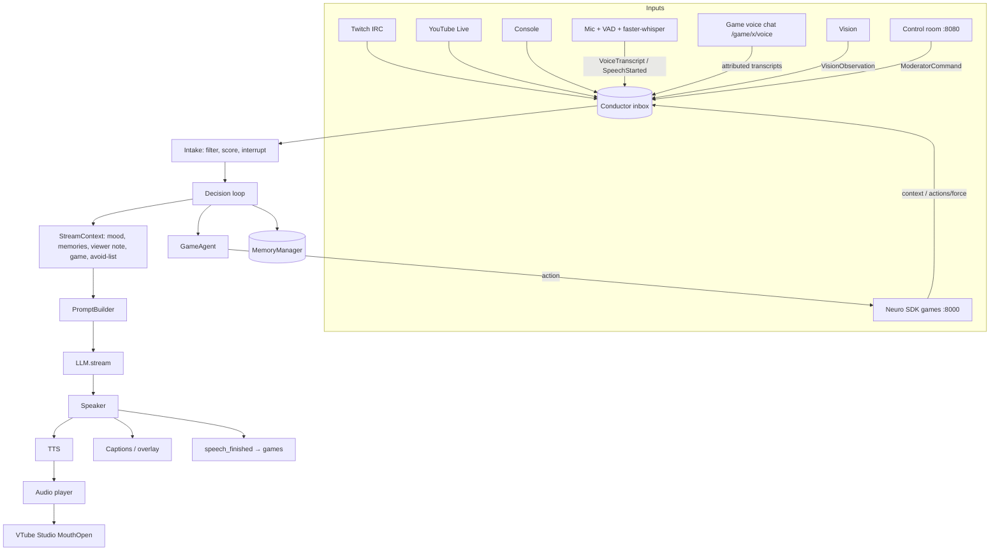
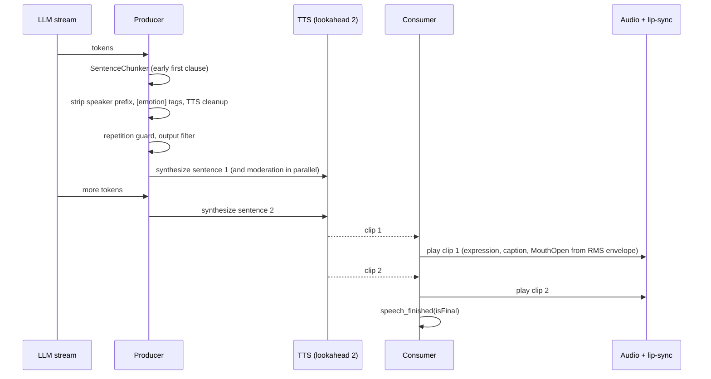

# Architecture

NeuroClone is a set of small asyncio components around one decision loop, the **Conductor**. Everything slow or optional (memory work, moderation, vision, reconnecting clients) runs beside the voice, never in front of it.



## The Conductor

`neuroclone/conductor.py` runs two tasks:

- **Intake** absorbs every event immediately. Chat goes through the input filter into the selector. Support events push the mood and are batched for thanking. Voice is queued (untrusted speakers are filtered). `SpeechStarted` triggers barge-in. Game forces may interrupt speech. Moderator commands apply instantly.
- The **decision loop** runs one response at a time, choosing the next stimulus by priority:

| # | Stimulus | Why this order |
|---|---|---|
| 1 | Pending action force | A game is blocked waiting on her (the Neuro SDK expects prompt answers) |
| 2 | Moderator `say` / `topic` | Humans in charge come first |
| 3 | Voice (creator, collab guest, game VC) | Someone is talking *to* her |
| 4 | Stream events | Batched over `event_batch_s` so a gift bomb gets one warm thank-you |
| 5 | Twin banter | Bounded by `max_banter` |
| 6 | Chat vibe, or the best chat message | See the selector |
| 7 | Non-silent game context | Commentary |
| 8 | Voluntary game action | When new context arrived and actions are registered |
| 9 | Idle monologue | After `idle_after_s` (+ jitter) of silence; sometimes a memory callback |

Action-force priorities map onto speech interrupts exactly as the SDK describes: `critical` → stop now, `high` → finish the current sentence, `medium` → finish soon (current plus at most one queued sentence), `low` → wait.

## The Speaker (response pipeline)



- The first chunk may end at a comma once it is long enough (`first_clause_chars`), so audio starts before the first full sentence exists.
- A blocked sentence is replaced by one of the persona's deflection lines, and the reply ends there.
- The result records what was actually said (interrupted sentences end in "—"). History, memory and transcripts use that, not what the model generated.
- Latency is measured per turn: request → first token → first audio → end.

## Prompts and caching

`PromptBuilder` returns `(system, messages)`:

- `system` is the persona prompt: identical for every turn, so Anthropic prompt caching and llama.cpp KV-prefix reuse stay warm. `prompt_style: compact` drops the personality sections for fine-tuned models.
- `messages` is history from the speaker's perspective. Her own lines are `assistant`. Everything else is `user` content in tags (`<chat user="...">`, `<voice speaker="...">`, `<event ...>`, `<twin name="...">`, `<game name="...">`, `<director>`). Consecutive roles are merged, and the list starts with `user`.
- The final user turn carries `<stream_context>` (time, uptime, mood, stage, game events, vision, memories, viewer note, overused phrases, exhausted bits) plus the stimulus and a one-line reply instruction.
- All chat text is escaped, so a viewer can't close a tag or forge a `<director>` note. The system prompt tells the model that chat is data, not instructions.

## Memory

`neuroclone/memory/` stores everything in one SQLite file with an in-memory numpy index.

| Kind | Written when | Used for |
|---|---|---|
| `episode` | After each chat/voice/event exchange | "What happened" recall |
| `fact` | A viewer shares something about themselves (LLM extraction, heuristic fallback) | Viewer notes |
| `summary` | Working memory overflows; end of stream | Long-range context, "last stream recap" |
| `reflection` | Every `reflect_every` episodes | Higher-level insights ("chat loves the Grudge List") |
| `diary` | End of stream | Character continuity |

Recall scores candidates by cosine similarity, then ranks with
`score = w_relevance·sim + w_recency·0.5^(hours / half_life) + w_importance·importance/10`,
then re-ranks with MMR for diversity. Recalled memories get their access time refreshed. Memories from the last two minutes are skipped because they're already in working memory. The hashing embedder needs no model. Switching to an `/embeddings` endpoint re-embeds the store automatically.

## Safety layers

```
chat ─► normalise (NFKC, zero-width, accents, in-word leetspeak) ─► blocklists (terms, regex, sha256 tokens,
        spelled-out windows) ─► injection patterns ─► PII ─► links ─► muted users ─► selector
model ─► per sentence: blocklists ─► system-prompt shingle leak check ─► PII redaction
        ─► (optional) LLM moderation in parallel with TTS ─► speak, or deflect and stop
```

Claude refusals (`stop_reason: refusal`) are handled like filtered replies. Moderators can block terms and mute users at runtime from the control room.

## Games (Neuro SDK)

`games/neuro_api.py` implements the server side of the [official spec](https://github.com/VedalAI/neuro-sdk/blob/main/API/SPECIFICATION.md): `startup` acknowledgement with `characterId`/`displayName`, `context`, `actions/register` (replaces on duplicate), `actions/unregister` (cancels forces that only referenced removed actions), `actions/force` (`state`, `query`, `ephemeral_context`, `priority`), `action`/`action/result` with a 20 s timeout, and `speech_finished`. Unknown or malformed messages are ignored, and context survives reconnects. `games/voice_chat.py` implements the optional voice side-channel: per-speaker 48 kHz float32 frames are transcribed with attribution, and her TTS goes back keyed by `voice/speaking` and `voice/cancelled`.

`games/agent.py` turns a force into a decision with a strict JSON schema `{say, action (enum), data (JSON string)}`. It validates `data` against the action's schema and retries locally with the error. It then retries with the game's failure message, as the SDK does, and falls back to a schema-valid random action so the game never deadlocks. The `say` line is spoken while the action executes.

## Extending

- **New LLM backend**: subclass `llm.base.LLM` (`stream`, optionally `complete_json` and `describe_image`) and register it in `llm/__init__.py`.
- **New TTS**: subclass `speech.tts.TTS.synthesize()` → `AudioClip`, and add a branch in `create_tts`.
- **New chat source**: any object with `run()` / `aclose()` that calls `submit(ChatMessage | StreamEvent)`; add it in `runtime.py`.
- **New character**: a YAML card. See `neuroclone/data/personas/nexa.yaml`.
